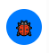

# Debug.js - A Browser-Based Debugging Tool

`debug.js` is a lightweight, self-contained JavaScript utility designed to enhance debugging in web applications. It provides an interactive, in-browser debug console that captures and organizes logs, errors, and network events, offering developers a more visual and manageable alternative to the browser's native console. Developed with the assistance of Grok, an AI created by xAI, this tool aims to streamline the debugging process with a clean UI and powerful features.

## Purpose

The primary purpose of `debug.js` is to:
- **Capture and Display Logs**: Replace or augment standard `console` methods with a tabbed interface for different log types (verbose, info, warnings, errors, debug, trace).
- **Track Errors**: Automatically log uncaught synchronous errors, promise rejections, and network issues (fetch/XHR) with detailed stack traces.
- **Enable Easy Sharing**: Allow developers to copy logs as clean JSON for analysis or reporting.
- **Improve Workflow**: Provide a searchable, filterable UI that stays out of the way until needed.

Whether you're debugging a complex app or just need a quick way to monitor logs, `debug.js` keeps everything organized and accessible.

## Features

- **Tabbed Interface**: Separate tabs for `verbose`, `info`, `warnings`, `errors`, `debug`, and `trace` logs, with unread count notifications.
- **Customizable Styling**: Override default styles to match your application's look and feel.
- **Searchable Logs**: Filter logs in real-time using a search input.
- **JSON Export**: Copy all logs as a structured JSON string with one click, free of UI formatting artifacts.
- **Console Overrides**: Seamlessly intercepts `console.log`, `console.info`, `console.warn`, `console.error`, `console.debug`, `console.trace`, `console.time`, and `console.timeEnd`.
- **Error Tracking**: Captures:
  - Uncaught synchronous errors (`window.onerror`).
  - Unhandled promise rejections (`unhandledrejection`).
  - Network errors and completions (fetch and XHR).
- **Pretty-Printed Objects**: Objects logged to the UI are displayed in a readable, indented format, while raw data is preserved for JSON export.
- **Minimal Footprint**: Runs as an IIFE (Immediately Invoked Function Expression) with no external dependencies.
- **Toggleable UI**: A floating firebug icon (shown below) toggles the debug panel on and off:

  

## Installation

1. **Add to Your Project**:
   - Copy `debug.js` into your project directory.
   - Include it in your HTML file:
     ```html
     <script src="path/to/debug.js"></script>
     ```

2. **Automatic Initialization**:
   - The script initializes itself upon loading, attaching a debug icon to the bottom-right corner of the page.

## Usage

### Basic Usage
Once included, `debug.js` automatically overrides standard `console` methods. Use them as you normally would:

```javascript
console.log("Hello, world!"); // Appears in the "Verbose" tab
console.info("App started");  // Appears in the "Info" tab
console.warn("Low memory");   // Appears in the "Warnings" tab
console.error("Crash!");      // Appears in the "Errors" tab
console.debug("x = 42");      // Appears in the "Debug" tab
console.trace("Stack here");  // Appears in the "Trace" tab

// Timing example
console.time("Loop");
for (let i = 0; i < 1000; i++) { /* work */ }
console.timeEnd("Loop"); // Logs "Loop: X.XXms" in "Info" tab
```

- Click the firebug icon (shown above) to open the debug panel.
- Switch between tabs to view different log types.
- Use the search bar to filter logs.
- Click "Copy as JSON" to export all logs.

### Logging Objects
Objects are displayed in a readable format in the UI and preserved as raw data in the JSON export:

```javascript
console.log({ name: "Test", value: 42 });
// UI shows:
// 2025-03-17T00:00:00.000Z - {
//   "name": "Test",
//   "value": 42
// }
// JSON export retains structure:
// {"verbose": [{"timestamp": "...", "message": {"name": "Test", "value": 42}}]}
```

### Custom Initialization
For more control, use the `DebugLog` API:

```javascript
// Initialize with custom styles
DebugLog.init({
    icon: { background: '#ff5733' }, // Orange icon
    container: { maxHeight: '70vh' } // Taller panel
});

// Log custom messages
DebugLog.log('info', 'Custom log', { extra: 'data' });
```

### Error Handling
Errors are automatically captured with stack traces:

```javascript
throw new Error("Oops!"); // Logged to "Errors" tab
fetch("https://invalid.url").catch(() => {}); // Network error logged
new Promise((_, reject) => reject("Failed")); // Promise rejection logged
```

## Customization

### Styling
Pass an object to `DebugLog.init()` to override `defaultStyles`. Keys match the style properties (e.g., `icon`, `container`, `tab`):

```javascript
DebugLog.init({
    icon: { bottom: '40px', right: '40px' },
    output: { fontSize: '16px' }
});
```

### Extending Functionality
Modify the source to add features like:
- Custom log types (add to `logBuffer` and `tabNames`).
- Persistent storage (e.g., save to `localStorage`).
- Advanced filtering (e.g., by timestamp).

## Development

`debug.js` was developed with the assistance of **Grok**, an AI created by xAI, which helped refine its logic, optimize its structure, and ensure a robust feature set. Contributions and feedback are welcome!


